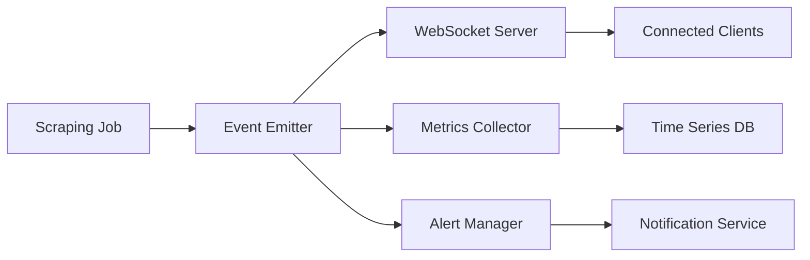

# Système de Monitoring en Temps Réel

## Table des Matières

1. [Vue d'ensemble](#vue-densemble)
2. [Architecture](#architecture)
3. [WebSocket Events](#websocket-events)
4. [Métriques](#métriques)
5. [Alertes](#alertes)
6. [Interface Utilisateur](#interface-utilisateur)
7. [Configuration](#configuration)
8. [Bonnes Pratiques](#bonnes-pratiques)
9. [Monitoring Spécifique Leboncoin](#monitoring-spécifique-leboncoin)

## Vue d'ensemble

Le système de monitoring en temps réel permet de suivre l'état et la progression des tâches de scraping via WebSocket. Il fournit :

- Suivi en direct des jobs de scraping
- Métriques de performance
- Alertes en temps réel
- Visualisation des données
- Historique des événements

## Architecture

### 1. Composants Principaux

```typescript
interface MonitoringSystem {
  websocket: WebSocketServer;
  metrics: MetricsCollector;
  alerts: AlertManager;
  storage: EventStorage;
  dashboard: DashboardUI;
}
```

### 2. Flux de Données



## WebSocket Events

### 1. Types d'Événements

```typescript
type WebSocketEventType =
  | 'job_started'
  | 'job_progress'
  | 'job_completed'
  | 'job_failed'
  | 'item_scraped'
  | 'error'
  | 'system_alert';

interface WebSocketEvent {
  type: WebSocketEventType;
  jobId: string;
  timestamp: string;
  data: any;
}
```

### 2. Exemples d'Événements

```typescript
// Job Started
{
  type: 'job_started',
  jobId: '123',
  timestamp: '2024-03-21T10:00:00Z',
  data: {
    source: 'ebay.com',
    query: 'vintage cards',
    config: {
      pageCount: 5
    }
  }
}

// Item Scraped
{
  type: 'item_scraped',
  jobId: '123',
  timestamp: '2024-03-21T10:00:05Z',
  data: {
    title: 'Vintage Pokemon Card',
    price: '29.99',
    url: 'https://...'
  }
}

// Job Completed
{
  type: 'job_completed',
  jobId: '123',
  timestamp: '2024-03-21T10:01:00Z',
  data: {
    itemsScraped: 50,
    duration: 60000,
    success: true
  }
}
```

## Métriques

### 1. Métriques Système

```typescript
interface SystemMetrics {
  cpu: {
    usage: number;
    load: number[];
  };
  memory: {
    used: number;
    total: number;
    free: number;
  };
  network: {
    requestsPerSecond: number;
    bytesTransferred: number;
  };
  workers: {
    active: number;
    idle: number;
    maxConcurrency: number;
  };
}
```

### 2. Métriques de Scraping

```typescript
interface ScrapingMetrics {
  jobs: {
    active: number;
    queued: number;
    completed: number;
    failed: number;
  };
  performance: {
    averageJobDuration: number;
    itemsPerSecond: number;
    successRate: number;
  };
  resources: {
    proxyUsage: number;
    bandwidthUsed: number;
  };
}
```

## Alertes

### 1. Configuration des Alertes

```typescript
interface AlertConfig {
  name: string;
  condition: {
    metric: string;
    operator: '>' | '<' | '==' | '>=';
    threshold: number;
  };
  severity: 'info' | 'warning' | 'error' | 'critical';
  channels: string[];
  cooldown: number;
}

const defaultAlerts: AlertConfig[] = [
  {
    name: 'high_failure_rate',
    condition: {
      metric: 'jobs.failureRate',
      operator: '>',
      threshold: 0.1
    },
    severity: 'warning',
    channels: ['slack', 'email'],
    cooldown: 300000
  },
  {
    name: 'system_overload',
    condition: {
      metric: 'system.cpu.usage',
      operator: '>',
      threshold: 0.8
    },
    severity: 'critical',
    channels: ['slack', 'email', 'sms'],
    cooldown: 60000
  }
];
```

### 2. Notification Channels

```typescript
interface NotificationChannel {
  type: 'email' | 'slack' | 'sms' | 'webhook';
  config: {
    recipients?: string[];
    webhook?: string;
    template?: string;
  };
}
```

## Interface Utilisateur

### 1. Dashboard Components

```typescript
interface DashboardConfig {
  layout: {
    panels: Panel[];
    refresh: number;
  };
  theme: {
    dark: boolean;
    colors: Record<string, string>;
  };
}

interface Panel {
  id: string;
  type: 'chart' | 'table' | 'stats' | 'log';
  title: string;
  data: {
    source: string;
    query?: string;
    transform?: string;
  };
  options: Record<string, any>;
}
```

### 2. Real-time Charts

```typescript
interface ChartConfig {
  type: 'line' | 'bar' | 'gauge';
  data: {
    metrics: string[];
    timeRange: number;
    aggregation: string;
  };
  display: {
    title: string;
    axes: {
      x: { label: string };
      y: { label: string };
    };
    legend: boolean;
  };
}
```

## Configuration

### 1. WebSocket Configuration

```typescript
interface WebSocketConfig {
  port: number;
  path: string;
  auth: {
    required: boolean;
    type: 'token' | 'basic';
  };
  compression: boolean;
  maxConnections: number;
  pingInterval: number;
  pingTimeout: number;
}
```

### 2. Storage Configuration

```typescript
interface StorageConfig {
  type: 'memory' | 'redis' | 'mongodb';
  retention: {
    events: number;    // en jours
    metrics: number;   // en jours
    logs: number;      // en jours
  };
  compression: boolean;
  backup: {
    enabled: boolean;
    interval: number;
    location: string;
  };
}
```

## Bonnes Pratiques

### 1. Performance

- Utiliser des buffers pour les événements fréquents
- Implémenter une fenêtre glissante pour les métriques
- Nettoyer régulièrement les anciennes données

```typescript
interface BufferConfig {
  size: number;
  flushInterval: number;
  batchSize: number;
}
```

### 2. Sécurité

- Authentifier toutes les connexions WebSocket
- Valider les données entrantes
- Limiter le taux de connexion par IP

```typescript
interface SecurityConfig {
  rateLimit: {
    connections: number;
    interval: number;
  };
  authentication: {
    required: boolean;
    type: 'token' | 'basic';
  };
  encryption: {
    enabled: boolean;
    algorithm: string;
  };
}
```

### 3. Fiabilité

- Implémenter des mécanismes de reconnexion
- Gérer la perte de connexion
- Mettre en cache les événements importants

```typescript
interface ReliabilityConfig {
  reconnect: {
    attempts: number;
    delay: number;
    backoff: number;
  };
  cache: {
    enabled: boolean;
    size: number;
    ttl: number;
  };
}
```

## Monitoring Spécifique Leboncoin

### 1. Métriques Temps Réel

```typescript
interface LeboncoinMetrics {
  // Métriques générales
  general: {
    activeJobs: number;
    queuedJobs: number;
    completedJobs: number;
    failedJobs: number;
    totalItemsScraped: number;
    averageScrapingTime: number;
  };
  
  // Métriques de performance
  performance: {
    responseTime: {
      min: number;
      max: number;
      avg: number;
      p95: number;
      p99: number;
    };
    successRate: number;
    errorRate: number;
    retryRate: number;
  };
  
  // Métriques de détection anti-bot
  antiBot: {
    captchaEncounters: number;
    blockingEvents: number;
    ipRotations: number;
    sessionResets: number;
  };
  
  // Métriques de ressources
  resources: {
    cpuUsage: number;
    memoryUsage: number;
    activeConnections: number;
    browserInstances: number;
  };
}
```

### 2. Dashboard Temps Réel

```typescript
// Configuration du dashboard
const dashboardConfig = {
  refreshInterval: 5000,  // 5 secondes
  retentionPeriod: '24h',
  alerts: {
    errorRate: {
      threshold: 0.1,  // 10%
      interval: '5m'
    },
    responseTime: {
      threshold: 5000,  // 5 secondes
      interval: '1m'
    },
    captcha: {
      threshold: 5,
      interval: '15m'
    }
  }
};

// Composants du dashboard
interface DashboardComponents {
  // Vue d'ensemble
  overview: {
    activeJobs: Widget<number>;
    successRate: Widget<number>;
    itemsScraped: Widget<number>;
    alerts: Widget<Alert[]>;
  };
  
  // Graphiques de performance
  charts: {
    responseTime: LineChart;
    successRate: LineChart;
    itemsPerMinute: LineChart;
    resourceUsage: AreaChart;
  };
  
  // Tableau des jobs actifs
  activeJobs: {
    id: string;
    status: string;
    progress: number;
    itemsScraped: number;
    startTime: string;
    estimatedCompletion: string;
    errors: string[];
  }[];
  
  // Logs en temps réel
  logs: {
    timestamp: string;
    level: 'info' | 'warning' | 'error';
    message: string;
    jobId?: string;
    details?: any;
  }[];
}
```

### 3. WebSocket Events

```typescript
// Événements émis par le serveur
interface ServerEvents {
  // Mise à jour des métriques
  'metrics:update': (metrics: LeboncoinMetrics) => void;
  
  // Événements de job
  'job:started': (job: JobInfo) => void;
  'job:progress': (progress: JobProgress) => void;
  'job:completed': (result: JobResult) => void;
  'job:error': (error: JobError) => void;
  
  // Événements de scraping
  'scraping:item': (item: ScrapedItem) => void;
  'scraping:page': (pageInfo: PageInfo) => void;
  'scraping:error': (error: ScrapingError) => void;
  
  // Alertes
  'alert:triggered': (alert: Alert) => void;
  'alert:resolved': (alert: Alert) => void;
}

// Événements envoyés par le client
interface ClientEvents {
  // Contrôle des jobs
  'job:pause': (jobId: string) => void;
  'job:resume': (jobId: string) => void;
  'job:cancel': (jobId: string) => void;
  
  // Configuration du monitoring
  'monitoring:configure': (config: MonitoringConfig) => void;
  'monitoring:subscribe': (filters: EventFilters) => void;
  'monitoring:unsubscribe': (filters: EventFilters) => void;
}
```

### 4. Alertes et Notifications

```typescript
interface AlertConfig {
  // Configuration des seuils
  thresholds: {
    errorRate: {
      warning: number;    // ex: 0.05 (5%)
      critical: number;   // ex: 0.10 (10%)
    };
    responseTime: {
      warning: number;    // ex: 3000ms
      critical: number;   // ex: 5000ms
    };
    captchaRate: {
      warning: number;    // ex: 0.02 (2%)
      critical: number;   // ex: 0.05 (5%)
    };
    successRate: {
      warning: number;    // ex: 0.95 (95%)
      critical: number;   // ex: 0.90 (90%)
    };
  };
  
  // Canaux de notification
  channels: {
    email: {
      enabled: boolean;
      recipients: string[];
      cooldown: number;  // Délai minimum entre notifications
    };
    slack: {
      enabled: boolean;
      webhook: string;
      channel: string;
      mentions: string[];
    };
    webhook: {
      enabled: boolean;
      url: string;
      headers: Record<string, string>;
    };
  };
  
  // Règles de notification
  rules: Array<{
    condition: AlertCondition;
    severity: 'info' | 'warning' | 'critical';
    message: string;
    channels: string[];
  }>;
}

// Exemple d'utilisation
const monitoring = new LeboncoinMonitoring({
  // Configuration du monitoring
  config: {
    metrics: {
      enabled: true,
      interval: 5000,
      retention: '24h'
    },
    alerts: alertConfig,
    dashboard: dashboardConfig
  },
  
  // Handlers d'événements
  handlers: {
    onMetricsUpdate: (metrics: LeboncoinMetrics) => {
      // Mise à jour du dashboard
      dashboard.update(metrics);
      
      // Vérification des alertes
      alertManager.check(metrics);
    },
    
    onJobProgress: (progress: JobProgress) => {
      // Mise à jour de la progression
      dashboard.updateJob(progress);
      
      // Estimation du temps restant
      const eta = estimateCompletion(progress);
      dashboard.updateETA(progress.jobId, eta);
    },
    
    onError: (error: ScrapingError) => {
      // Logging de l'erreur
      logger.error(error);
      
      // Notification si nécessaire
      if (error.severity === 'critical') {
        notificationManager.notify({
          type: 'error',
          message: `Erreur critique: ${error.message}`,
          details: error
        });
      }
    }
  }
});

// Démarrage du monitoring
monitoring.start();
```

### 5. Visualisation des Données

```typescript
interface DashboardViews {
  // Vue générale
  overview: {
    component: 'Overview';
    data: {
      activeJobs: number;
      successRate: number;
      itemsScraped: number;
      alerts: Alert[];
    };
    refresh: 5000;  // ms
  };
  
  // Vue performance
  performance: {
    component: 'Performance';
    data: {
      charts: {
        responseTime: TimeSeriesData;
        successRate: TimeSeriesData;
        throughput: TimeSeriesData;
      };
      stats: {
        avg: number;
        p95: number;
        p99: number;
      };
    };
    refresh: 10000;  // ms
  };
  
  // Vue détaillée des jobs
  jobs: {
    component: 'JobsList';
    data: {
      active: Job[];
      completed: Job[];
      failed: Job[];
    };
    refresh: 5000;  // ms
  };
  
  // Vue des erreurs
  errors: {
    component: 'ErrorLog';
    data: {
      recent: ScrapingError[];
      trends: {
        byType: Record<string, number>;
        byTime: TimeSeriesData;
      };
    };
    refresh: 15000;  // ms
  };
}

// Configuration des graphiques
const chartConfig = {
  responseTime: {
    type: 'line',
    options: {
      scales: {
        y: {
          beginAtZero: true,
          title: 'Temps de réponse (ms)'
        }
      },
      plugins: {
        annotation: {
          annotations: {
            warning: {
              type: 'line',
              yMin: 3000,
              yMax: 3000,
              borderColor: 'orange'
            },
            critical: {
              type: 'line',
              yMin: 5000,
              yMax: 5000,
              borderColor: 'red'
            }
          }
        }
      }
    }
  },
  // ... autres configurations de graphiques
};
``` 