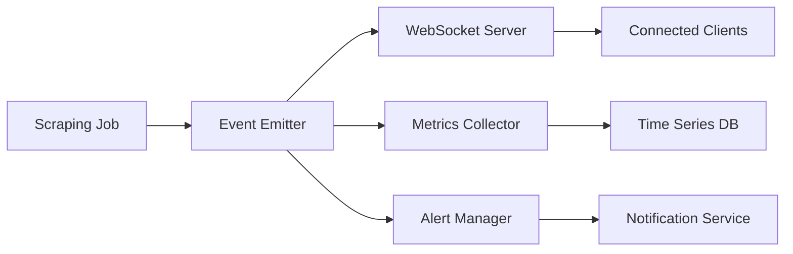

# Système de Monitoring en Temps Réel

## Table des Matières

1. [Vue d'ensemble](#vue-densemble)
2. [Architecture](#architecture)
3. [WebSocket Events](#websocket-events)
4. [Métriques](#métriques)
5. [Alertes](#alertes)
6. [Interface Utilisateur](#interface-utilisateur)
7. [Configuration](#configuration)
8. [Bonnes Pratiques](#bonnes-pratiques)

## Vue d'ensemble

Le système de monitoring en temps réel permet de suivre l'état et la progression des tâches de scraping via WebSocket. Il fournit :

- Suivi en direct des jobs de scraping
- Métriques de performance
- Alertes en temps réel
- Visualisation des données
- Historique des événements

## Architecture

### 1. Composants Principaux

```typescript
interface MonitoringSystem {
  websocket: WebSocketServer;
  metrics: MetricsCollector;
  alerts: AlertManager;
  storage: EventStorage;
  dashboard: DashboardUI;
}
```

### 2. Flux de Données



## WebSocket Events

### 1. Types d'Événements

```typescript
type WebSocketEventType =
  | 'job_started'
  | 'job_progress'
  | 'job_completed'
  | 'job_failed'
  | 'item_scraped'
  | 'error'
  | 'system_alert';

interface WebSocketEvent {
  type: WebSocketEventType;
  jobId: string;
  timestamp: string;
  data: any;
}
```

### 2. Exemples d'Événements

```typescript
// Job Started
{
  type: 'job_started',
  jobId: '123',
  timestamp: '2024-03-21T10:00:00Z',
  data: {
    source: 'ebay.com',
    query: 'vintage cards',
    config: {
      pageCount: 5
    }
  }
}

// Item Scraped
{
  type: 'item_scraped',
  jobId: '123',
  timestamp: '2024-03-21T10:00:05Z',
  data: {
    title: 'Vintage Pokemon Card',
    price: '29.99',
    url: 'https://...'
  }
}

// Job Completed
{
  type: 'job_completed',
  jobId: '123',
  timestamp: '2024-03-21T10:01:00Z',
  data: {
    itemsScraped: 50,
    duration: 60000,
    success: true
  }
}
```

## Métriques

### 1. Métriques Système

```typescript
interface SystemMetrics {
  cpu: {
    usage: number;
    load: number[];
  };
  memory: {
    used: number;
    total: number;
    free: number;
  };
  network: {
    requestsPerSecond: number;
    bytesTransferred: number;
  };
  workers: {
    active: number;
    idle: number;
    maxConcurrency: number;
  };
}
```

### 2. Métriques de Scraping

```typescript
interface ScrapingMetrics {
  jobs: {
    active: number;
    queued: number;
    completed: number;
    failed: number;
  };
  performance: {
    averageJobDuration: number;
    itemsPerSecond: number;
    successRate: number;
  };
  resources: {
    proxyUsage: number;
    bandwidthUsed: number;
  };
}
```

## Alertes

### 1. Configuration des Alertes

```typescript
interface AlertConfig {
  name: string;
  condition: {
    metric: string;
    operator: '>' | '<' | '==' | '>=';
    threshold: number;
  };
  severity: 'info' | 'warning' | 'error' | 'critical';
  channels: string[];
  cooldown: number;
}

const defaultAlerts: AlertConfig[] = [
  {
    name: 'high_failure_rate',
    condition: {
      metric: 'jobs.failureRate',
      operator: '>',
      threshold: 0.1
    },
    severity: 'warning',
    channels: ['slack', 'email'],
    cooldown: 300000
  },
  {
    name: 'system_overload',
    condition: {
      metric: 'system.cpu.usage',
      operator: '>',
      threshold: 0.8
    },
    severity: 'critical',
    channels: ['slack', 'email', 'sms'],
    cooldown: 60000
  }
];
```

### 2. Notification Channels

```typescript
interface NotificationChannel {
  type: 'email' | 'slack' | 'sms' | 'webhook';
  config: {
    recipients?: string[];
    webhook?: string;
    template?: string;
  };
}
```

## Interface Utilisateur

### 1. Dashboard Components

```typescript
interface DashboardConfig {
  layout: {
    panels: Panel[];
    refresh: number;
  };
  theme: {
    dark: boolean;
    colors: Record<string, string>;
  };
}

interface Panel {
  id: string;
  type: 'chart' | 'table' | 'stats' | 'log';
  title: string;
  data: {
    source: string;
    query?: string;
    transform?: string;
  };
  options: Record<string, any>;
}
```

### 2. Real-time Charts

```typescript
interface ChartConfig {
  type: 'line' | 'bar' | 'gauge';
  data: {
    metrics: string[];
    timeRange: number;
    aggregation: string;
  };
  display: {
    title: string;
    axes: {
      x: { label: string };
      y: { label: string };
    };
    legend: boolean;
  };
}
```

## Configuration

### 1. WebSocket Configuration

```typescript
interface WebSocketConfig {
  port: number;
  path: string;
  auth: {
    required: boolean;
    type: 'token' | 'basic';
  };
  compression: boolean;
  maxConnections: number;
  pingInterval: number;
  pingTimeout: number;
}
```

### 2. Storage Configuration

```typescript
interface StorageConfig {
  type: 'memory' | 'redis' | 'mongodb';
  retention: {
    events: number;    // en jours
    metrics: number;   // en jours
    logs: number;      // en jours
  };
  compression: boolean;
  backup: {
    enabled: boolean;
    interval: number;
    location: string;
  };
}
```

## Bonnes Pratiques

### 1. Performance

- Utiliser des buffers pour les événements fréquents
- Implémenter une fenêtre glissante pour les métriques
- Nettoyer régulièrement les anciennes données

```typescript
interface BufferConfig {
  size: number;
  flushInterval: number;
  batchSize: number;
}
```

### 2. Sécurité

- Authentifier toutes les connexions WebSocket
- Valider les données entrantes
- Limiter le taux de connexion par IP

```typescript
interface SecurityConfig {
  rateLimit: {
    connections: number;
    interval: number;
  };
  authentication: {
    required: boolean;
    type: 'token' | 'basic';
  };
  encryption: {
    enabled: boolean;
    algorithm: string;
  };
}
```

### 3. Fiabilité

- Implémenter des mécanismes de reconnexion
- Gérer la perte de connexion
- Mettre en cache les événements importants

```typescript
interface ReliabilityConfig {
  reconnect: {
    attempts: number;
    delay: number;
    backoff: number;
  };
  cache: {
    enabled: boolean;
    size: number;
    ttl: number;
  };
}
``` 