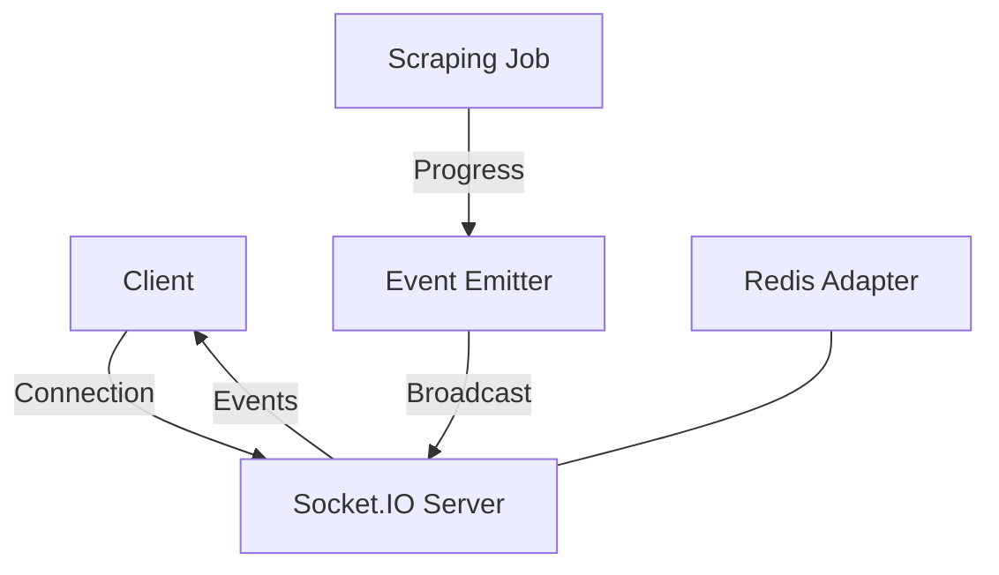

# Intégration Socket.IO

## Table des Matières

1. [Vue d'ensemble](#vue-densemble)
2. [Configuration](#configuration)
3. [Événements](#événements)
4. [Authentification](#authentification)
5. [Gestion des Rooms](#gestion-des-rooms)
6. [Exemples d'Utilisation](#exemples-dutilisation)
7. [Bonnes Pratiques](#bonnes-pratiques)
8. [Dépannage](#dépannage)

## Vue d'ensemble

L'intégration Socket.IO permet une communication bidirectionnelle en temps réel entre le serveur et les clients pour le monitoring des jobs de scraping.

### Architecture



## Configuration

### 1. Configuration Serveur

```typescript
// src/config/socket.ts
import { Server } from 'socket.io';
import { createAdapter } from '@socket.io/redis-adapter';
import Redis from 'ioredis';

export interface SocketConfig {
  port: number;
  path: string;
  redis: {
    host: string;
    port: number;
    password?: string;
  };
  cors: {
    origin: string[];
    credentials: boolean;
  };
}

export const createSocketServer = (config: SocketConfig) => {
  const io = new Server({
    path: config.path,
    cors: config.cors,
    transports: ['websocket', 'polling'],
  });

  // Configuration Redis Adapter
  const pubClient = new Redis(config.redis);
  const subClient = pubClient.duplicate();

  io.adapter(createAdapter(pubClient, subClient));

  return io;
};
```

### 2. Middleware

```typescript
// src/middleware/socket.ts
import { Socket } from 'socket.io';
import { verifyToken } from '../utils/auth';

export const authMiddleware = async (socket: Socket, next: Function) => {
  try {
    const token = socket.handshake.auth.token;
    if (!token) {
      throw new Error('Authentication required');
    }

    const user = await verifyToken(token);
    socket.data.user = user;
    next();
  } catch (error) {
    next(new Error('Authentication failed'));
  }
};
```

## Événements

### 1. Types d'Événements

```typescript
// src/types/socket.ts
export interface SocketEvent {
  type: EventType;
  jobId: string;
  timestamp: string;
  data: any;
}

export enum EventType {
  JOB_STARTED = 'job_started',
  JOB_PROGRESS = 'job_progress',
  JOB_COMPLETED = 'job_completed',
  JOB_FAILED = 'job_failed',
  ITEM_SCRAPED = 'item_scraped',
  ERROR = 'error'
}

export interface JobProgressData {
  itemsScraped: number;
  pagesScraped: number;
  currentPage: number;
  totalPages: number;
  elapsedTime: number;
}
```

### 2. Gestionnaire d'Événements

```typescript
// src/services/SocketService.ts
import { Server, Socket } from 'socket.io';
import { EventEmitter } from 'events';
import { SocketEvent, EventType } from '../types/socket';

export class SocketService {
  private io: Server;
  private eventEmitter: EventEmitter;

  constructor(io: Server) {
    this.io = io;
    this.eventEmitter = new EventEmitter();
    this.setupEventHandlers();
  }

  private setupEventHandlers() {
    this.io.on('connection', (socket: Socket) => {
      console.log(`Client connected: ${socket.id}`);

      socket.on('subscribe', (jobId: string) => {
        socket.join(`job:${jobId}`);
        console.log(`Client ${socket.id} subscribed to job ${jobId}`);
      });

      socket.on('unsubscribe', (jobId: string) => {
        socket.leave(`job:${jobId}`);
        console.log(`Client ${socket.id} unsubscribed from job ${jobId}`);
      });

      socket.on('disconnect', () => {
        console.log(`Client disconnected: ${socket.id}`);
      });
    });

    this.eventEmitter.on('scraping_event', (event: SocketEvent) => {
      this.broadcastEvent(event);
    });
  }

  private broadcastEvent(event: SocketEvent) {
    this.io.to(`job:${event.jobId}`).emit('event', event);
  }

  public emitEvent(event: SocketEvent) {
    this.eventEmitter.emit('scraping_event', event);
  }
}
```

## Authentification

### 1. Configuration Client

```typescript
// Client-side authentication
const socket = io('http://localhost:3000', {
  auth: {
    token: 'your-jwt-token'
  }
});

socket.on('connect_error', (error) => {
  if (error.message === 'Authentication failed') {
    console.error('Socket authentication failed');
  }
});
```

### 2. Gestion des Sessions

```typescript
// src/services/SessionManager.ts
export class SessionManager {
  private sessions: Map<string, Set<string>> = new Map();

  public addSession(userId: string, socketId: string) {
    if (!this.sessions.has(userId)) {
      this.sessions.set(userId, new Set());
    }
    this.sessions.get(userId)!.add(socketId);
  }

  public removeSession(userId: string, socketId: string) {
    const userSessions = this.sessions.get(userId);
    if (userSessions) {
      userSessions.delete(socketId);
      if (userSessions.size === 0) {
        this.sessions.delete(userId);
      }
    }
  }

  public getUserSessions(userId: string): Set<string> {
    return this.sessions.get(userId) || new Set();
  }
}
```

## Gestion des Rooms

### 1. Structure des Rooms

```typescript
// src/types/rooms.ts
export interface Room {
  id: string;
  type: 'job' | 'user' | 'system';
  members: Set<string>;
  metadata?: Record<string, any>;
}

export class RoomManager {
  private rooms: Map<string, Room> = new Map();

  public createRoom(roomId: string, type: Room['type']): Room {
    const room: Room = {
      id: roomId,
      type,
      members: new Set()
    };
    this.rooms.set(roomId, room);
    return room;
  }

  public addMember(roomId: string, socketId: string) {
    const room = this.rooms.get(roomId);
    if (room) {
      room.members.add(socketId);
    }
  }

  public removeMember(roomId: string, socketId: string) {
    const room = this.rooms.get(roomId);
    if (room) {
      room.members.delete(socketId);
      if (room.members.size === 0) {
        this.rooms.delete(roomId);
      }
    }
  }
}
```

## Exemples d'Utilisation

### 1. Client Simple

```typescript
// Client-side implementation
import { io } from 'socket.io-client';

class ScrapingClient {
  private socket: Socket;
  private eventHandlers: Map<string, Function[]> = new Map();

  constructor(url: string, options: any = {}) {
    this.socket = io(url, options);
    this.setupEventHandlers();
  }

  private setupEventHandlers() {
    this.socket.on('connect', () => {
      console.log('Connected to server');
    });

    this.socket.on('event', (event: SocketEvent) => {
      const handlers = this.eventHandlers.get(event.type) || [];
      handlers.forEach(handler => handler(event));
    });

    this.socket.on('error', (error) => {
      console.error('Socket error:', error);
    });
  }

  public subscribeToJob(jobId: string) {
    this.socket.emit('subscribe', jobId);
  }

  public unsubscribeFromJob(jobId: string) {
    this.socket.emit('unsubscribe', jobId);
  }

  public on(eventType: EventType, handler: Function) {
    if (!this.eventHandlers.has(eventType)) {
      this.eventHandlers.set(eventType, []);
    }
    this.eventHandlers.get(eventType)!.push(handler);
  }

  public disconnect() {
    this.socket.disconnect();
  }
}
```

### 2. Monitoring Dashboard

```typescript
// Example dashboard implementation
const client = new ScrapingClient('http://localhost:3000', {
  auth: { token: 'your-jwt-token' }
});

client.on(EventType.JOB_STARTED, (event) => {
  console.log(`Job ${event.jobId} started`);
  updateJobStatus(event.jobId, 'running');
});

client.on(EventType.JOB_PROGRESS, (event) => {
  const { itemsScraped, pagesScraped, totalPages } = event.data;
  updateProgressBar(event.jobId, (pagesScraped / totalPages) * 100);
  updateItemCount(event.jobId, itemsScraped);
});

client.on(EventType.ITEM_SCRAPED, (event) => {
  addItemToList(event.jobId, event.data);
});

client.on(EventType.JOB_COMPLETED, (event) => {
  console.log(`Job ${event.jobId} completed`);
  updateJobStatus(event.jobId, 'completed');
  showCompletionSummary(event.data);
});
```

## Bonnes Pratiques

### 1. Gestion des Reconnexions

```typescript
// Client-side reconnection handling
const socket = io('http://localhost:3000', {
  reconnection: true,
  reconnectionAttempts: 5,
  reconnectionDelay: 1000,
  reconnectionDelayMax: 5000,
  timeout: 20000,
});

socket.on('reconnect_attempt', (attempt) => {
  console.log(`Reconnection attempt ${attempt}`);
});

socket.on('reconnect', (attempt) => {
  console.log(`Reconnected after ${attempt} attempts`);
  // Resubscribe to rooms
  activeJobs.forEach(jobId => socket.emit('subscribe', jobId));
});
```

### 2. Gestion de la Charge

```typescript
// Server-side load management
export class LoadBalancer {
  private maxClientsPerWorker: number = 1000;
  private workers: Map<string, number> = new Map();

  public assignWorker(socketId: string): string {
    const workers = Array.from(this.workers.entries());
    const worker = workers.reduce((min, current) => {
      return current[1] < min[1] ? current : min;
    });
    
    this.workers.set(worker[0], worker[1] + 1);
    return worker[0];
  }

  public removeClient(workerId: string) {
    const count = this.workers.get(workerId) || 0;
    if (count > 0) {
      this.workers.set(workerId, count - 1);
    }
  }
}
```

## Dépannage

### 1. Diagnostics

```typescript
// Diagnostic middleware
export const diagnosticMiddleware = (socket: Socket, next: Function) => {
  const startTime = Date.now();
  
  socket.on('disconnect', () => {
    const duration = Date.now() - startTime;
    console.log(`Client ${socket.id} disconnected after ${duration}ms`);
  });

  socket.on('error', (error) => {
    console.error(`Error for client ${socket.id}:`, error);
  });

  next();
};
```

### 2. Monitoring

```typescript
// Socket monitoring
export class SocketMonitor {
  private metrics: {
    connections: number;
    messagesSent: number;
    messagesReceived: number;
    errors: number;
  } = {
    connections: 0,
    messagesSent: 0,
    messagesReceived: 0,
    errors: 0
  };

  public incrementMetric(metric: keyof typeof this.metrics) {
    this.metrics[metric]++;
  }

  public getMetrics() {
    return { ...this.metrics };
  }

  public resetMetrics() {
    Object.keys(this.metrics).forEach(key => {
      this.metrics[key as keyof typeof this.metrics] = 0;
    });
  }
}
``` 